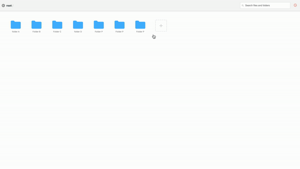

# drive-app

The Drive app mimic the behavior of a standard file system. These files are not real.

## Demo

### Register and Login

### Create File and Folder

### Rename And Delete File

### sample .env 

client/

REACT_APP_SERVER_URL=http://localhost:4000

server/

CLIENT=https://yourclient.com
ENV=production
MONGO_URL=mongodb+srv://admin:<password>@cluster0.dtsta.mongodb.net/drive

